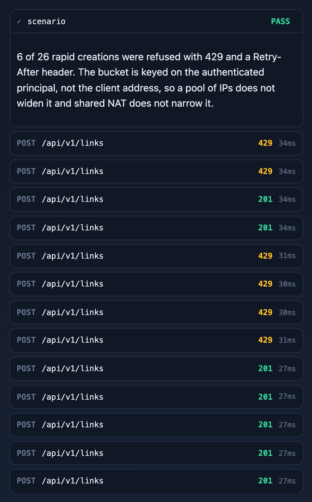

# Demo walkthrough

This is the guided tour of the running system. Every screenshot below was taken from a live
instance against real PostgreSQL and Redis, and every one of them can be reproduced in about
thirty seconds by anyone with Docker.

```bash
docker compose up --build          # then open http://localhost:8080
```

## Why the console looks like this

Almost nothing this service does is visible in a user interface. The decisions worth reviewing
are expressed as status codes and headers — `200` versus `201` for a repeated URL, `404`
versus `410` for a link that is gone, `422` for a refused destination, `Retry-After` on a
rate-limit refusal — and a conventional link manager renders a short link identically in every
one of those cases. A reviewer would see a green box and learn nothing.

So the console is a request inspector with controls attached, rather than a link manager with
a log bolted on. The panel on the right lists every call it makes with its status, timing,
request body and the response headers that carried a decision. The scenario buttons on the
left drive multi-step flows and then say in plain language what the result proves.


The design rationale, and the constraints that ruled out a bundled single-page app, are in
[ADR-012](decisions/ADR-012-demo-console.md).

## Signing in

The three demo accounts differ only in role: `alice` and `bob` are ordinary users, `admin`
also holds `ROLE_ADMIN`. Passwords are `<name>-password` and the accounts exist only when
`shortener.security.seed-demo-users` is on, which logs a warning at startup.


The token is decoded in the browser purely for display; the signature is not checked there,
because only the server holds the key. Two claims are worth pointing at:

- **`kid`** names the signing key. It is what makes key rotation possible without invalidating
  every token in flight — the server can verify against several keys while signing with one.
- **`jti`** is the token's identity, and it is what revocation revokes. Without it the only
  way to withdraw a token early is to rotate the key and log everyone out.

The note under the buttons is honest about a dependency: revocation needs Redis, and without
it the endpoint answers `503`. Telling someone a leaked token is dead while it still works is
worse than admitting the failure.

## The same URL twice


The first submission creates a link and returns `201`. The second returns `200` with the same
code, because this owner already has a link to that destination.

The status is the whole point. A client that timed out and retried cannot otherwise tell
whether its first attempt landed, and the alternative — minting a second code — silently
splits the click analytics for one campaign across two links. Reuse is scoped to your own
links and only applies to plain requests: a custom alias, an explicit expiry, or
`"forceNew": true` always mints a new code. See
[ADR-010](decisions/ADR-010-url-deduplication.md).

## What every response carries


Expanding any entry shows the headers that came back. This one is an ordinary link creation,
and it carries:

- `x-ratelimit-limit` and `x-ratelimit-remaining`, so a well-behaved client can slow down
  before it is refused rather than after.
- `location`, pointing at the created resource.
- The full security header set on every response, not just on the HTML page:
  `content-security-policy`, `x-frame-options: DENY`, `x-content-type-options: nosniff`,
  `referrer-policy` and `permissions-policy`.

`frame-ancestors 'none'` is the load-bearing one. It stops a hostile page framing the redirect
endpoint to harvest the click without showing the address bar.

`strict-transport-security` is absent here and that is correct: the demo runs over plain HTTP,
and HSTS is only emitted over TLS. Behind a terminating proxy it appears once
`server.forward-headers-strategy` tells the application what the original scheme was.

## A destination that fails screening


The destination is on the blocklist, so creation is refused with `422` and an RFC 9457 problem
document.

Read the `detail` field carefully: *"This destination has been flagged as unsafe and cannot be
shortened."* It does not say which check fired, which feed matched, or what the match was.
Naming the check would turn the endpoint into an oracle — submit, read the reason, adjust,
resubmit — and an attacker with an oracle tunes past a blocklist quickly. Nothing is persisted
either: no row, no code, and no sequence value consumed.

**Running this scenario repeatedly will lock you out, and that is the control working.** Five
refused creations within an hour suspends the account and revokes its tokens, so a sixth
attempt — and every subsequent sign-in — fails. This was found by taking these screenshots:
enough runs accumulated to suspend `admin`, after which the audit and analytics panels came
back empty and sign-in stopped working.

The behaviour is right. Rate limiting caps how *fast* someone tries; this responds to *what*
they are trying, and someone probing a blocklist five times in an hour is not a confused user.
Two things about it are not right, and both are recorded rather than quietly fixed:

- A suspended user gets a generic `401` with no indication that their account was suspended or
  why. That is deliberate — an error that distinguishes "wrong password" from "suspended"
  leaks account state to whoever is guessing — but it is genuinely poor for a legitimate user
  who now has no path to support. A real deployment needs an out-of-band notification.
- Nothing in the product lifts a suspension. The seeder now re-enables the demo accounts on
  startup, so restarting the application resets the demo, but that only covers accounts the
  seeder owns. A production system needs an operator endpoint for this, and it does not have
  one.

## Retiring a link


The owner retires the link, and visiting it now returns `404`.

`404` rather than `403` is the decision worth defending. A `403` says *this exists but you may
not have it*, which confirms to anyone scanning the code space that they found a real code —
the one bit an enumeration attacker cannot otherwise obtain, and the reason short codes are
non-sequential in the first place. The same reasoning applies to fetching a link you do not
own: a non-owner gets `404`, not `403`. Retirement is also a flag rather than a delete, so the
click history survives and a campaign report stays intact after its links come down. See
[ADR-007](decisions/ADR-007-expiry-and-retirement.md).

## A destination that turns hostile later


This is the case a create-time check alone can never catch. The link is created and redirects
normally. Its destination is then blocked, a sweep re-screens live links, and the same code
now answers `410 Gone`.

`410` rather than `404` is deliberate, and it is the opposite of the choice made for retired
links. Someone following a link that was taken down after they received it is not the
adversary; telling them the destination was withdrawn is the difference between a warning and
an apparently broken site. A retired link answers `404` instead, because there the risk is an
enumeration attacker learning that a code exists.

The `?all=true` on the rescan call matters operationally. The scheduled sweep only examines
links screened longer ago than the rescan interval, which means the moment an operator most
wants a sweep — immediately after blocking a domain — is exactly when it would skip the links
that matter.

## Sustained creation



Twenty-six creations fired as fast as the browser will send them: the burst capacity is
allowed and the rest are refused with `429` and a `Retry-After`.

The bucket is keyed on the authenticated principal rather than the client address. An
address-keyed limiter is bypassed with a pool of IPs and simultaneously over-restricts
everyone behind a shared NAT, so it punishes the wrong people in both directions. See
[ADR-005](decisions/ADR-005-rate-limiting.md).

If Redis is unavailable this scenario reports that nothing was refused, which is the
documented behaviour rather than a bug: the limiter fails open. Refusing to create links
because the rate limiter is down converts a degraded dependency into an outage.

## Withdrawing a token


The token is revoked and the very next call is refused with `401`, long before it would have
expired on its own.

This is the gap that bearer tokens leave by default. A short expiry shortens the window but
never closes it, and until there is a revocation list a leaked token is valid until it lapses.
Whether revocation fails open or closed when Redis is down is configurable
(`shortener.security.revocation-fail-closed`); it defaults to fail-open so a cache outage
cannot lock every user out, and deployments that would rather refuse than risk honouring a
revoked token can invert it.

## Analytics


Clicks are buffered in memory and flushed in batches roughly once a second, so the redirect
never waits on an analytics write.

The consequence is stated in the payload itself rather than hidden in documentation: counts
are best-effort and eventually consistent, and recent clicks may lag by a few seconds. Under
sustained pressure the buffer sheds load, which means a click can be dropped. That is the
right trade for this system — a redirect that is slow or fails because a counter could not be
incremented is a worse product than a count that is occasionally short by one — but it is a
trade, and a caller must not treat these numbers as billing-grade. See
[ADR-004](decisions/ADR-004-async-analytics.md).

## The audit trail


Every security-relevant action is recorded with its actor, target, outcome and time:
`TOKEN_ISSUED`, `TOKEN_REVOKED`, `LINK_SCREENING_BLOCKED`, `DOMAIN_BLOCKED`,
`LINK_QUARANTINED`, `LINK_RETIRED`, `ADMIN_LINK_ACCESS`, `ACCOUNT_SUSPENDED`.

Two properties make it worth having. It is **append-only at the database level** — triggers
reject `UPDATE` and `DELETE`, so the application cannot rewrite history even if it is
compromised or simply wrong, and the integration test proves it with raw SQL rather than
through the repository. And writes happen in their own transaction, so an audit record
survives the rollback of whatever it was recording. An audit trail that disappears alongside
the event it describes is not evidence.

Note the `system` actor on one quarantine row and `admin` on the other: the sweep records
itself distinctly from an operator action.

## Everything at once


Two details in the middle column are deliberate.

The link list is held in browser storage, and the copy says so, because the API has no "list
my links" endpoint. That is a real gap. A client-side cache dressed up as a server feature
would have hidden it; naming it in the interface keeps the omission visible.

The `REUSED` and `RETIRED` tags carry the outcome of the last operation on each link, so the
list stays readable after a scenario has run without needing the wire log to interpret it.

## Regenerating these images

The screenshots are produced by a script rather than taken by hand:

```bash
docker compose up -d && mvn spring-boot:run       # app on :8080
node scripts/capture-console.mjs                  # writes docs/images/*.png
```

It drives headless Chrome over the DevTools Protocol with no dependencies beyond Node 22+ and
a local Chrome. Documentation screenshots rot quietly — the interface changes, the images do
not, and nobody notices until a reviewer is looking at a picture of something that no longer
exists. Making them reproducible is the only way that stays honest.

The script also fails the run on any page exception or CSP violation, so it doubles as a smoke
test that the console works under the production Content Security Policy without it being
relaxed.
